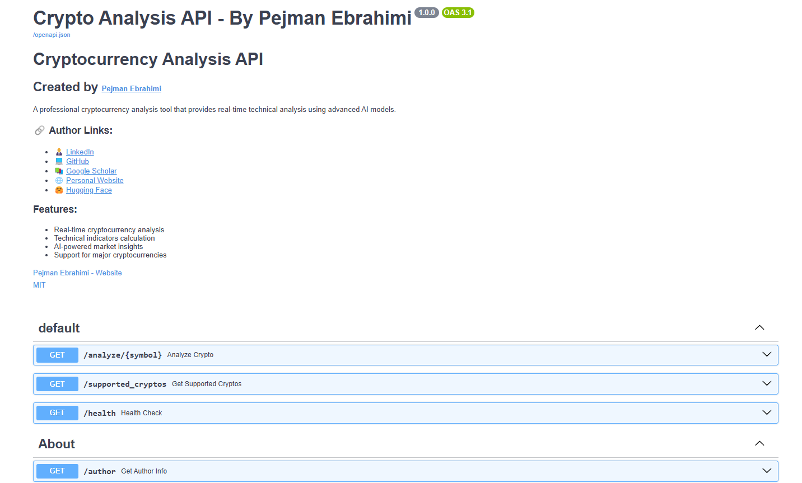
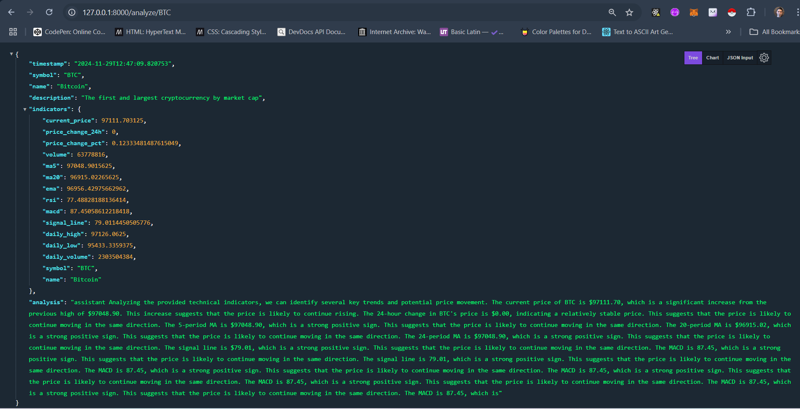
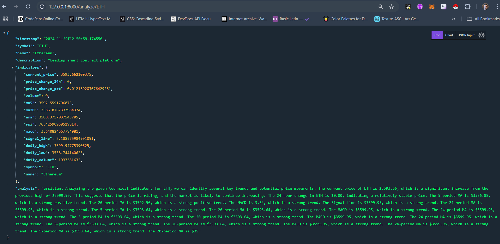

# Crypto Analysis App_Fastapi_llama3.2 🚀

A professional FastAPI-based cryptocurrency analysis tool that provides real-time technical analysis using the SmolLM2 AI model. This application offers comprehensive technical indicators and AI-powered market insights for major cryptocurrencies.

[](https://fastapi.tiangolo.com/)
[](https://www.python.org/)
[](https://opensource.org/licenses/Apache-2.0)
[](https://www.linkedin.com/in/pejman-ebrahimi-4a60151a7/)
[](https://huggingface.co/arad1367)
[](https://arad1367.github.io/pejman-ebrahimi/)
[](https://www.giltech-megoldasok.com/)


## Table of Contents
- [Features](#features)
- [Screenshots](#screenshots)
- [Video Tutorial](#video-tutorial)
- [Technical Indicators](#technical-indicators)
- [Supported Cryptocurrencies](#supported-cryptocurrencies)
- [Installation](#installation)
- [Usage](#usage)
- [API Endpoints](#api-endpoints)
- [Example Response](#example-response)
- [Technologies Used](#technologies-used)
- [Author](#author)
- [License](#license)

## Features
- Real-time cryptocurrency price analysis
- Advanced technical indicators calculation
- AI-powered market insights using SmolLM2
- Support for major cryptocurrencies
- Professional trading recommendations
- RESTful API design
- Interactive Swagger UI documentation

## Screenshots
### Application Interface


### Example Analyses
| Bitcoin Analysis | Ethereum Analysis |
|:----------------:|:-----------------:|
|  |  |

## Video Tutorial
Watch a demonstration of the Crypto Analysis API in action:

[](https://youtu.be/D-m4HtlmEAw "Crypto Analysis API Tutorial")

<details>
<summary>🎥 Click to watch the video walkthrough</summary>

https://www.youtube.com/watch?v=D-m4HtlmEAw

Key points covered in the video:
- Real-time cryptocurrency analysis
- Technical indicators explanation
- API usage demonstration
- Live market insights
</details>

## Technical Indicators
- Real-time price data
- 5 & 20 period Moving Averages
- Exponential Moving Average (EMA)
- Relative Strength Index (RSI)
- Moving Average Convergence Divergence (MACD)
- Volume analysis
- Price momentum indicators

## Supported Cryptocurrencies
- Bitcoin (BTC)
- Ethereum (ETH)
- Binance Coin (BNB)
- Ripple (XRP)
- Solana (SOL)
- Cardano (ADA)
- Dogecoin (DOGE)
- Polygon (MATIC)
- Polkadot (DOT)
- Shiba Inu (SHIB)

## Installation
1. Clone the repository
```bash
git clone https://github.com/arad1367/Crypto-Analysis-App_Fastapi_llama3.2.git
cd Crypto-Analysis-App_Fastapi_llama3.2
```

2. Create and activate virtual environment
```bash
python -m venv venv
# On Windows
venv\Scripts\activate
# On Unix or MacOS
source venv/bin/activate
```

3. Install dependencies
```bash
pip install -r requirements.txt
```

## Usage
1. Start the API server
```bash
python app.py
```

2. Access the API documentation at:
```
http://127.0.0.1:8000/docs
```

## API Endpoints
| Endpoint | Method | Description |
|----------|---------|------------|
| `/analyze/{symbol}` | GET | Get detailed analysis for a specific cryptocurrency |
| `/supported_cryptos` | GET | List all supported cryptocurrencies |
| `/health` | GET | Check API health status |
| `/author` | GET | Get information about the author |

## Example Response
```json
{
    "timestamp": "2024-11-29T10:30:00",
    "symbol": "BTC",
    "name": "Bitcoin",
    "description": "The first and largest cryptocurrency by market cap",
    "indicators": {
        "current_price": 96713.10,
        "price_change_24h": 2345.67,
        "rsi": 65.32,
        // ... other indicators
    },
    "analysis": "Detailed AI-powered market analysis..."
}
```

## Technologies Used
- FastAPI
- SmolLM2 AI Model
- Python 3.8+
- PyTorch
- Transformers
- yfinance
- pandas
- uvicorn

## Author
**Pejman Ebrahimi**
- 📧 Email: [pejman.ebrahimi@uni.li](mailto:pejman.ebrahimi@uni.li) | [pejman.ebrahimi77@gmail.com](mailto:pejman.ebrahimi77@gmail.com)
- 🔗 LinkedIn: [Pejman Ebrahimi](https://www.linkedin.com/in/pejman-ebrahimi-4a60151a7/)
- 💻 GitHub: [arad1367](https://github.com/arad1367)
- 📚 Google Scholar: [Profile](https://scholar.google.com/citations?user=zO-nHd0AAAAJ&hl=en)
- 🌐 Website: [Personal Website](https://arad1367.github.io/pejman-ebrahimi/)
- 🤗 Hugging Face: [arad1367](https://huggingface.co/arad1367)

## License
This project is licensed under the Apache License 2.0 - see the [LICENSE](LICENSE) file for details. The Apache License 2.0 is a permissive license that allows you to:

- ✅ Freely use, modify, and distribute this software
- ✅ Use the software for commercial purposes
- ✅ Patent use
- ℹ️ Requires preservation of copyright and license notices
- ℹ️ Changes must be documented
- ℹ️ Include the original license
- ℹ️ Cannot use trademarks

For the complete license details, see [Apache License 2.0](https://opensource.org/licenses/Apache-2.0).

---
Made with ❤️ by Pejman Ebrahimi